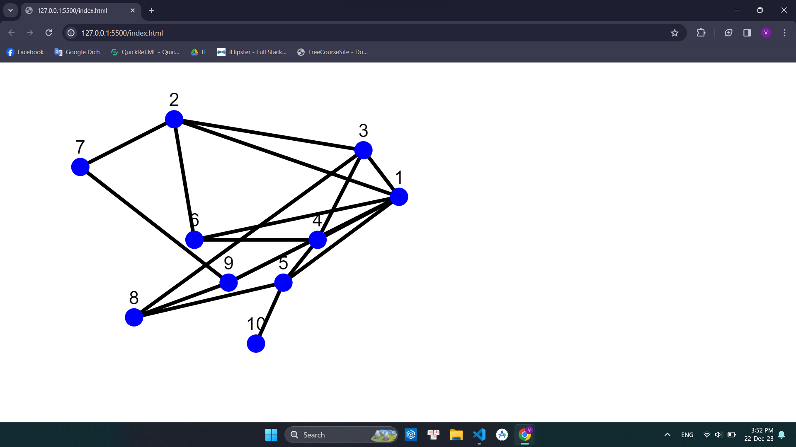

# Mô tả về Project

Project này sử dụng thư viện Cytoscape để tạo ra một đồ thị. Đồ thị này bao gồm các nút và cạnh.
## kết quả
!
## Các nút

Có tổng cộng 10 nút trong đồ thị, được đánh số từ 1 đến 10.

## Các cạnh

Các cạnh trong đồ thị biểu diễn mối quan hệ giữa các nút. Mỗi cạnh được xác định bởi một nút nguồn và một nút đích.

## Giao diện

Các nút được hiển thị với màu nền xanh và kích thước 5px. Các cạnh có màu đen và độ rộng là 1px.

## Bố cục

Đồ thị sử dụng bố cục concentric, trong đó các nút được sắp xếp theo các vòng tròn xung quanh một điểm trung tâm.

# Hướng dẫn thay đổi dữ liệu

## Thay đổi các nút

Mỗi nút trong đồ thị được định nghĩa bởi một đối tượng trong mảng `elements` có thuộc tính `data` chỉ chứa `id`. Ví dụ, để thêm một nút mới với ID là '11', bạn thêm đối tượng sau vào mảng `elements`:

```javascript
{
    data: {
        id: '11'
    }
}
```
## Thay đổi các cạnh
Mỗi cạnh trong đồ thị được định nghĩa bởi một đối tượng trong mảng elements có thuộc tính data chứa source và target. source và target là các ID của nút. Ví dụ, để thêm một cạnh mới từ nút ‘1’ đến nút ‘11’, bạn thêm đối tượng sau vào mảng elements:

```javascript
{
    data: {
        source: '1',
        target: '11'
    }
}
```
## Thay đổi giao diện
Để thay đổi giao diện của các nút và cạnh, bạn chỉnh sửa mảng style. Mỗi đối tượng trong style chứa một selector để chọn nút hoặc cạnh, và một style để định nghĩa giao diện. Ví dụ, để thay đổi màu nền của các nút thành đỏ, bạn tìm đối tượng có selector là ‘node’ và thay đổi giá trị của ‘background-color’ thành ‘red’.